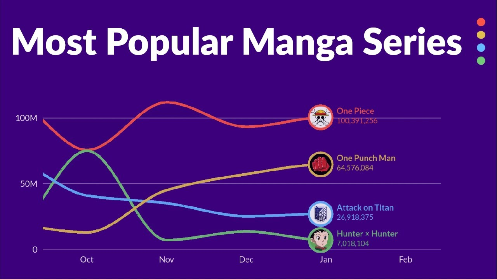
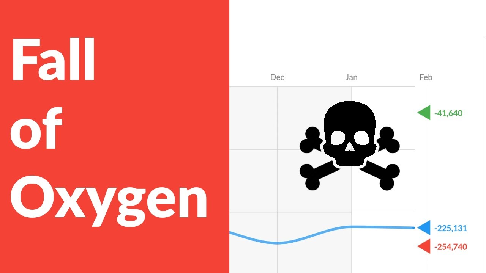
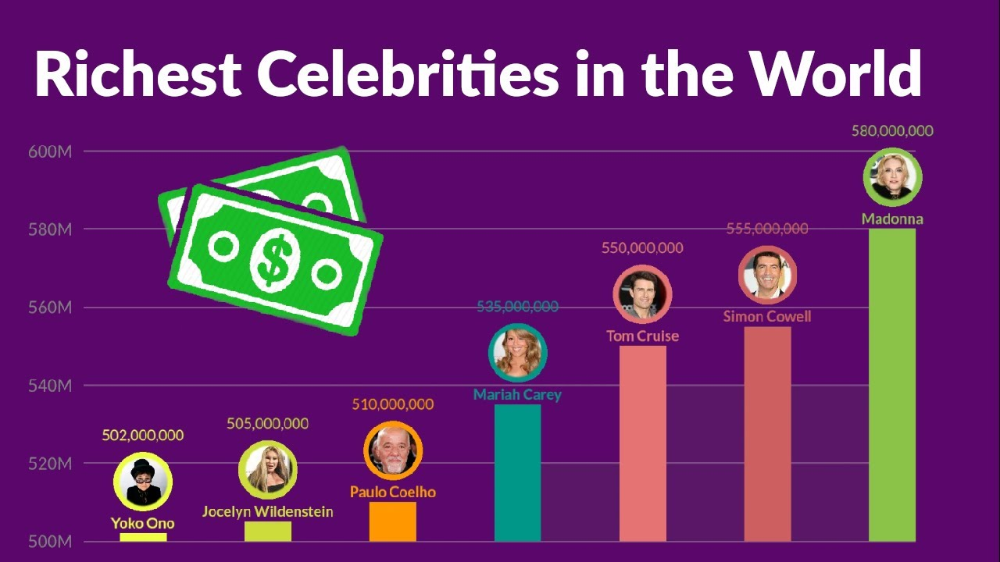

# The Visual Show

## Overview
The Visual Show is a project designed to create animated charts in JavaScript and convert them into MP4 videos by capturing frames one by one and merging them at the end for download. This project utilizes various JavaScript libraries found in the `lib` directory.

## Getting Started
To run this project, navigate to the root directory and use one of the following commands:

### Using Python
```bash
python -m http.server 3000
```

### Using npm
```bash
npm install -g http-server
http-server -p 3000
```

## Accessing the Charts
Once the server is running, you can access the following charts in your web browser:
- [Falling Chart](http://localhost:3000/charts/falling)
- [Line Chart](http://localhost:3000/charts/line)
- [Pointer Chart](http://localhost:3000/charts/pointer)

## Libraries Used
The project leverages several powerful JavaScript libraries from the `lib` directory:

### Core Libraries
- **pixi.js**: A powerful 2D WebGL renderer that handles the chart animations and graphics rendering. It provides high-performance canvas rendering and interactive graphics capabilities essential for smooth chart animations.

### Video Capture and Processing
- **CCapture.js** (`CCapture.js`, `CCapture.min.js`, `CCapture.all.min.js`): The backbone of the video generation process. It:
  - Captures each frame of the animation in real-time
  - Maintains frame rate consistency
  - Handles memory management during long captures
  - Supports multiple export formats

### Export Formats
- **gif.js** & **gif.worker.js**: Enables GIF creation from captured frames
- **Whammy.js**: WebM video encoder for creating video files
- **webm-writer-0.2.0.js**: Additional WebM encoding capabilities
- **tar.js**: Provides file compression and packaging functionality

### Performance Monitoring
- **fps.js**: Monitors and displays frame rates during capture to ensure smooth animation

### Utility
- **download.js**: Handles the download of generated videos and other files

## How It Works
1. **Chart Creation**: Using Pixi.js, dynamic charts are created with smooth animations and transitions
2. **Frame Capture**: CCapture.js records each frame of the animation at a specified frame rate
3. **Processing**: The captured frames are processed and encoded into the desired format (MP4, WebM, or GIF)
4. **Export**: The final video is compiled and made available for download

## Video Generation
All videos generated using this code as a base are uploaded to our YouTube channel:

<div align="center">
  <a href="https://www.youtube.com/@thevisualshow5644">
    
  </a>
  <h3><a href="https://www.youtube.com/@thevisualshow5644">The Visual Show</a></h3>
</div>

### Featured Videos
[](https://youtu.be/7cByUxjHpcQ?si=rHFFupTV_9NHdns0)
[](https://youtu.be/TyGZ5SC81qM?si=JxTxSlrPixNE8OCf)
[](https://youtu.be/NiktStQx88Q?si=hSFmyrFZtuKT9f4c)


